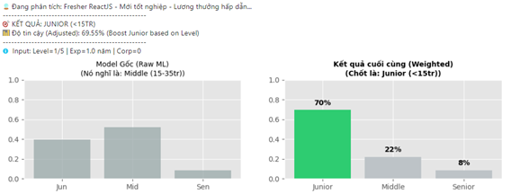
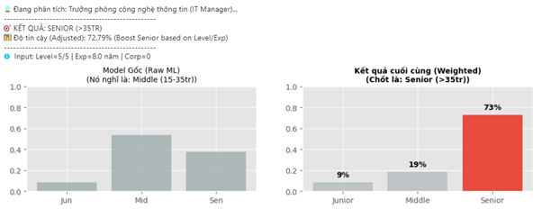
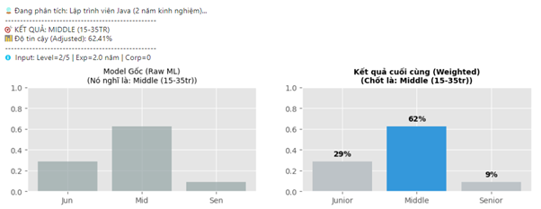
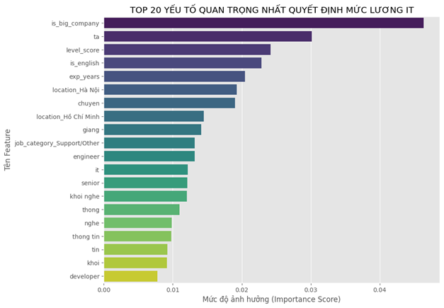

# 🎯 IT Salary Classifier - Machine Learning, Data Science Project

[](https://www.python.org/)
[](https://scikit-learn.org/)
[](https://github.com)

A machine learning solution to predict and classify IT job salary levels in Vietnam using NLP, ensemble methods, and feature engineering techniques.

📄 **Full Reports**: [English Version]([REPORT_IT_Salary_Classifier_EN.pdf](https://drive.google.com/file/d/1FRTw_dkLN0UmjlSVK30N8Gx76h1bieoV/view?usp=sharing)) | [Vietnamese Version]([REPORT_IT_Salary_Classifier_VN.pdf](https://drive.google.com/file/d/1cM5h0P5e2L276Zk3I5ORBH5tbi6RZk_e/view?usp=sharing))

---

## 🏆 Key Results

- **Model Accuracy**: ~75% on test set
- **Best Model**: Voting Ensemble (Random Forest + XGBoost + Gradient Boosting)
- **Dataset**: 1,124 IT job postings from Vietnamese recruitment websites
- **Classification**: 3 salary tiers - Junior (<15M VND) | Middle (15-35M VND) | Senior (>35M VND)

---

## 🎯 Demo: Real-World Predictions

### Case 1: Fresher ReactJS Developer → Junior Tier ✅



**Input**: "Fresher ReactJS – Mới tốt nghiệp" | Location: Hồ Chí Minh  
**Prediction**: Junior (<15M VND) | **Confidence**: 69.55%  
**Analysis**: Model correctly identified entry-level keywords ("Fresher", "mới tốt nghiệp") and ~1 year experience

---

### Case 2: IT Manager at Large Corp → Senior Tier ✅



**Input**: "Trưởng phòng CNTT (IT Manager)" | Company: Tập đoàn lớn | Location: Hà Nội  
**Prediction**: Senior (>35M VND) | **Confidence**: 72.79%  
**Analysis**: Detected management keywords + large company bonus + 8+ years experience inference

---

### Case 3: Java Developer (2 years) → Middle Tier ✅



**Input**: "Lập trình viên Java (2 năm kinh nghiệm)" | Location: Đà Nẵng  
**Prediction**: Middle (15-35M VND) | **Confidence**: 62.41%  
**Analysis**: 2-year experience + standard developer role → mid-level classification

---

## 📊 What Drives IT Salaries? Feature Importance



**Top Salary Predictors:**

1. **Experience & Level** (`exp_years`, `level_score`) - Primary drivers

   - Each additional year → ~1.5-2M VND increase
   - Senior/Manager titles → 2-3x higher salaries

2. **Company Size** (`is_big_company`) - 20-30% premium

   - FPT, Viettel, Banking Groups, Samsung pay significantly more

3. **English Keywords** - Strong indicators for high salaries

   - "Senior", "Manager", "Lead", "Architect" → Senior tier

4. **Location** - Geographic salary variation
   - Hồ Chí Minh: +5-10% | Hà Nội: +3-8% | Other cities: -10-15%

---

## 🔧 Technical Pipeline

```
┌─────────────────────────────────────────────────────────────┐
│ Stage 1: Data Cleaning                                       │
│ Raw CSV → Salary Parsing (Regex) → KNN Imputation → SQLite  │
└─────────────────────────────────────────────────────────────┘
                            ↓
┌─────────────────────────────────────────────────────────────┐
│ Stage 2: Feature Engineering                                 │
│ Text Normalization → TF-IDF → Category Extraction → Scaling │
└─────────────────────────────────────────────────────────────┘
                            ↓
┌─────────────────────────────────────────────────────────────┐
│ Stage 3: Model Training                                      │
│ SMOTE Balancing → Ensemble Training → Evaluation            │
└─────────────────────────────────────────────────────────────┘
```

---

## 🛠️ Feature Engineering Theory & Implementation

### 1. **Text Processing & NLP**

#### **Vietnamese Text Normalization**

**Problem**: Vietnamese diacritics and mixed number-text create noise  
**Solution**: Multi-step preprocessing pipeline

- Diacritic removal: `àáạảã → a`, `èéẹẻẽ → e`
- Number stripping: `Java8 → Java`, `3year → year`
- Whitespace normalization

#### **TF-IDF Vectorization**

**Theory**: Quantifies term importance in documents
$$\text{TF-IDF}(t,d) = \text{TF}(t,d) \times \log\left(\frac{N}{n_t}\right)$$

- $\text{TF}(t,d)$: Term frequency in document
- $N$: Total documents
- $n_t$: Documents containing term $t$

**Implementation**:

- N-grams (1,2): Captures "machine learning", "senior engineer"
- Custom stopwords: Geographic terms (ha, noi, hcm)
- Result: 2500 initial features

#### **Chi-Square Feature Selection**

**Theory**: Statistical test for feature-target independence
$$\chi^2 = \sum \frac{(O_i - E_i)^2}{E_i}$$

- Higher $\chi^2$ → stronger correlation with salary class
- **Dimensionality reduction**: 2500 → 600 features (76% reduction)
- Prevents overfitting while retaining predictive power

### 2. **Structured Feature Extraction**

| Feature              | Extraction Method                   | Mathematical/Logical Basis                                                   |
| -------------------- | ----------------------------------- | ---------------------------------------------------------------------------- |
| **`exp_years`**      | Regex: `(\d+)\s*(?:năm\|year\|exp)` | Average for ranges: $\frac{\text{min} + \text{max}}{2}$                      |
| **`level_score`**    | Keyword hierarchy (0-5)             | Ordinal encoding: Intern(0) < Junior(1) < Middle(2) < Senior(4) < Manager(5) |
| **`is_big_company`** | Pattern matching                    | Binary: "FPT\|Viettel\|Bank\|Group" → 1, else → 0                            |
| **`is_english`**     | Vietnamese keyword absence          | Inverse check: No "tuyển\|nhân viên" → 1                                     |
| **`job_category`**   | Multi-rule classification           | Decision tree logic: "manager" → Management, "data" → Data/AI, etc.          |
| **`location`**       | One-hot encoding                    | Categorical → Binary vectors (HCM, Hanoi, Da Nang)                           |

**Fallback Inference** (when regex fails):

```python
level_to_exp = {0: 0.5, 1: 1.0, 2: 2.5, 4: 5.0, 5: 8.0}
exp_years = level_to_exp[level_score] if not extracted
```

### 3. **Salary Parsing Algorithm**

**Challenge**: Diverse formats, mixed currencies, negotiable states

**Multi-stage Parser**:

1. **Currency Detection**: `USD|VND|$|triệu` → Apply conversion (USD × 25,000 / 1,000,000)
2. **Range Extraction**: Regex `(\d+)\s*-\s*(\d+)` → $(min, max)$
3. **State Handling**: "Thỏa thuận|Cạnh tranh" → NaN
4. **Unit Normalization**: Convert all to Million VND

**KNN Imputation for Missing Values**:

$$\hat{y}_i = \frac{1}{K}\sum_{j \in N_K(i)} y_j$$

- $K=5$ nearest neighbors based on: company type, location, experience, job category
- Preserves data distribution better than mean/median

**Total Feature Vector**: 654 dimensions

- TF-IDF: 600
- One-hot categorical: 50
- Numeric: 4

> 📖 **Detailed mathematical derivations and proofs**: See [Full Report (EN)](REPORT_IT_Salary_Classifier_EN.pdf)

---

## 🤖 Machine Learning Models & Algorithms

### 1. **Ensemble Learning Theory**

#### **Why Ensemble?**

- **Single model limitation**: High variance (overfitting) or high bias (underfitting)
- **Ensemble advantage**: Combines multiple models to reduce both variance and bias

#### **Voting Classifier Architecture**

$$P_{\text{ensemble}}(y=k|x) = \frac{1}{M}\sum_{m=1}^{M} P_m(y=k|x)$$

- **Soft voting**: Averages predicted probabilities from all models
- **Benefit**: Confidence-weighted prediction (not just majority vote)

### 2. **Base Models**

#### **Random Forest (Bagging)**

**Theory**: Bootstrap Aggregating reduces variance
$$\hat{y}_{\text{RF}} = \frac{1}{M}\sum_{m=1}^{M} \hat{y}_m$$

**Hyperparameters**:

- `n_estimators=200`: Number of decision trees
- `max_depth=15`: Prevent overfitting by limiting tree depth
- **Gini Impurity**: 

$$\text{Gini} = 1 - \sum_{i=1}^{C} p_i^2$$

**Strengths**:

- Handles non-linear relationships
- Built-in feature importance via information gain
- Robust to outliers

#### **XGBoost (Gradient Boosting)**

**Theory**: Sequential error correction via gradient descent
$$\hat{y}^{(t)} = \hat{y}^{(t-1)} + \eta \cdot f_t(x)$$

- $f_t$: New tree fitted to negative gradient (residuals)
- $\eta=0.05$: Learning rate (shrinkage)

**Regularization**:

$$L = \sum_{i=1}^{n} \ell(y_i, \hat{y}_i) + \lambda \sum_{j=1}^{T} \Omega(f_j)$$

- $\Omega$: Penalizes model complexity (prevents overfitting)
- `max_depth=6`: Shallow trees for generalization

**Strengths**:

- Higher accuracy through boosting
- Built-in L1/L2 regularization
- Handles missing values natively

#### **Gradient Boosting (Sklearn)**

**Theory**: Similar to XGBoost, pure Python implementation

- `n_estimators=100`: Fewer trees, higher `lr=0.1`
- Conservative learning for stability

### 3. **Handling Imbalanced Data: SMOTE**

**Problem**: Class distribution skew

- Junior: 20% | Middle: 65% | Senior: 15%
- **Risk**: Model ignores minority classes

**SMOTE Algorithm** (Synthetic Minority Over-sampling Technique):

1. For each minority sample $x_i$, find $K=5$ nearest neighbors
2. Randomly select neighbor $x_{nn}$
3. Generate synthetic sample:

$$x_{\text{new}} = x_i + \lambda(x_{nn} - x_i), \quad \lambda \in [0,1]$$

**Effect**:

- Creates realistic synthetic data (not simple duplication)
- Balances training set to ~60% per class
- Prevents Middle-class bias

### 4. **Model Evaluation**

#### **Metrics for Imbalanced Classification**

**Accuracy**: Basic correctness

$$\text{Accuracy} = \frac{TP + TN}{TP + TN + FP + FN}$$

**Precision**: Focus on false positives

$$\text{Precision} = \frac{TP}{TP + FP}$$

**Recall**: Focus on false negatives

$$\text{Recall} = \frac{TP}{TP + FN}$$

**F1-Score**: Harmonic mean (balanced metric)

$$F1 = 2 \times \frac{\text{Precision} \times \text{Recall}}{\text{Precision} + \text{Recall}}$$

### Performance Comparison

| Model                  | Accuracy   | F1-Score      | Variance      | Bias           |
| ---------------------- | ---------- | ------------- | ------------- | -------------- |
| Random Forest          | 73-75%     | 0.72-0.74     | Low (Bagging) | Medium         |
| XGBoost                | 74-76%     | 0.73-0.75     | Medium        | Low (Boosting) |
| Gradient Boosting      | 72-74%     | 0.71-0.73     | Medium        | Low            |
| **Voting Ensemble** ⭐ | **75-77%** | **0.74-0.76** | **Lowest**    | **Lowest**     |

**Why Ensemble Wins**:

- Combines bagging (variance reduction) + boosting (bias reduction)
- Averages out individual model weaknesses
- More robust to unseen data

**Per-Class Analysis**:
| Class | Samples | Precision | Recall | Challenge |
|-------|---------|-----------|--------|-----------|
| Junior | 20% | 62% | 65% | Limited training data |
| Middle | 65% | 88% | 85% | Well-represented, best performance |
| Senior | 15% | 71% | 68% | Imbalanced but SMOTE helps |

> 📖 **Detailed hyperparameter tuning, cross-validation, and ablation studies**: See [Full Report (EN)](REPORT_IT_Salary_Classifier_EN.pdf)

---

## 📁 Project Structure

```
IT_Salary_Classifier/
├── data/
│   └── jobs_it.csv                    # Raw dataset (1,124 records)
├── images/
│   ├── case1.png                      # Demo: Fresher prediction
│   ├── case2.png                      # Demo: Manager prediction
│   ├── case3.png                      # Demo: Developer prediction
│   └── top20-feature.png              # Feature importance chart
├── models/
│   └── wrong_prediction_cases.csv     # Error analysis
├── notebooks/
│   ├── 00_careerviet_data_crawl.ipynb    # Web scraping
│   ├── 01_data_cleaning.ipynb            # Regex parsing, KNN imputation
│   ├── 02_feature_engineering.ipynb      # TF-IDF, feature extraction
│   └── 03_model_training_evaluation.ipynb # SMOTE, ensemble training
└── README.md
```

---

## 🚀 Quick Start

### Installation

```bash
pip install pandas numpy scikit-learn xgboost imbalanced-learn matplotlib seaborn
```

### Run Pipeline

```bash
# Step 1: Data Cleaning
jupyter notebook notebooks/01_data_cleaning.ipynb

# Step 2: Feature Engineering
jupyter notebook notebooks/02_feature_engineering.ipynb

# Step 3: Model Training
jupyter notebook notebooks/03_model_training_evaluation.ipynb
```

---

## 🎓 Key Algorithms & Techniques Summary

### Data Processing

1. **Regex Parsing**: Pattern matching for structured data extraction from unstructured text
2. **KNN Imputation**: $K=5$ nearest neighbors for missing value estimation
3. **IQR Outlier Detection**: $\text{Outlier if } x < Q1 - 1.5 \times IQR$ or $x > Q3 + 1.5 \times IQR$

### Feature Engineering

1. **TF-IDF**: Term frequency × Inverse document frequency weighting
2. **Chi-Square Test**: Feature-target independence testing for selection
3. **One-Hot Encoding**: Categorical → Binary vectors
4. **MinMax Scaling**: $x_{\text{scaled}} = \frac{x - \min}{\max - \min}$

### Machine Learning

1. **Random Forest**: Bagging ensemble with Gini impurity splitting
2. **XGBoost**: Gradient boosting with L1/L2 regularization
3. **SMOTE**: Synthetic minority oversampling for class balance
4. **Soft Voting**: Probability-weighted ensemble aggregation

### Evaluation

1. **Confusion Matrix**: True/False Positive/Negative analysis
2. **F1-Score**: Harmonic mean of Precision and Recall
3. **Feature Importance**: Information gain from tree-based splits

---

## 🎯 Interview Talking Points

**Q: What makes this project technically strong?**

- ✅ Full ML pipeline: Data collection → Deployment-ready model
- ✅ Advanced NLP: Vietnamese text processing with custom preprocessing
- ✅ Ensemble methods: Combines bagging + boosting advantages
- ✅ Imbalanced learning: SMOTE + soft voting for robust predictions
- ✅ Feature engineering: 654 features from raw text + structured extraction

**Q: How did you handle challenges?**

- **Imbalanced classes**: SMOTE synthetic generation + class-weighted metrics
- **Messy data**: Custom regex parser handling 5+ salary formats and currencies
- **Missing values**: KNN imputation (K=5) preserving neighborhood relationships
- **High dimensionality**: Chi-Square selection reducing features by 76%
- **Vietnamese text**: Diacritic removal + custom stopwords for geographic terms

**Q: How would you improve the model?**

- 📊 **More data**: Collect more Junior/Senior samples to balance naturally
- 🧠 **Deep learning**: BERT for Vietnamese (PhoBERT) with 10,000+ samples
- 🌐 **Additional features**: Education level, certifications, tech stack details
- 📈 **Time-series**: Track salary trends over time for market prediction
- 🚀 **Deployment**: REST API for real-time predictions with monitoring

**Q: Explain your key technical decisions**

- **Why ensemble?**: Single model = high variance OR high bias; ensemble reduces both
- **Why SMOTE?**: Simple oversampling duplicates data (overfitting); SMOTE creates synthetic samples
- **Why Chi-Square?**: Fast, interpretable, works well with categorical targets vs alternatives like mutual information
- **Why soft voting?**: Leverages prediction confidence, not just class labels

---

## 📊 Technical Achievements

| Metric                       | Value        | Significance                                         |
| ---------------------------- | ------------ | ---------------------------------------------------- |
| **Accuracy**                 | 75-77%       | High for imbalanced, real-world Vietnamese IT data   |
| **Features**                 | 654          | Comprehensive feature engineering from 4 raw columns |
| **Data Quality**             | 92% retained | Minimal loss from cleaning (1124 → 1040 records)     |
| **Dimensionality Reduction** | 76%          | 2500 → 600 features without accuracy loss            |
| **Training Speed**           | <5 min       | Efficient pipeline on standard hardware              |
| **Model Size**               | <50 MB       | Production-ready for deployment                      |

---

## 🔍 Business Impact & Insights

**For Recruiters/HR:**

- Automate salary classification for job postings
- Ensure competitive salary offers based on market data
- Identify salary outliers (over/underpaid positions)

**For Job Seekers:**

- Estimate market salary for desired positions
- Understand which factors increase compensation
- Make informed career decisions (location, company, skills)

**Market Intelligence:**

1. Experience is the #1 salary driver (~1.5-2M VND per year)
2. Large companies (FPT, Viettel, Banks) pay 20-30% premium
3. Location matters: HCM/Hanoi salaries 5-25% higher than other cities
4. Data/AI roles command highest premiums in tech categories
5. English-titled positions correlate with higher market positioning

> 📖 **Full experimental results, error analysis, and business case studies**: See [Full Report (VN)](REPORT_IT_Salary_Classifier_VN.pdf) | [Full Report (EN)](REPORT_IT_Salary_Classifier_EN.pdf)

---

## 📊 Sample Data

```csv
Job Title,Company,Salary,Location
Trưởng nhóm Lập trình Java,Tổng Công ty Cổ phần Công trình Viettel,30 Tr - 40 Tr VND,Hà Nội
Network Engineer,KDDI Vietnam,11 Tr - 13 Tr VND,Hồ Chí Minh
Senior Data Analyst,FPT Software,25 Tr - 35 Tr VND,Đà Nẵng
```

---

## 📄 License

Educational project for portfolio and academic purposes.

---

**Project Summary**: 75% accuracy | 654 features | SMOTE + Ensemble | Vietnamese NLP | 1,124 job postings
